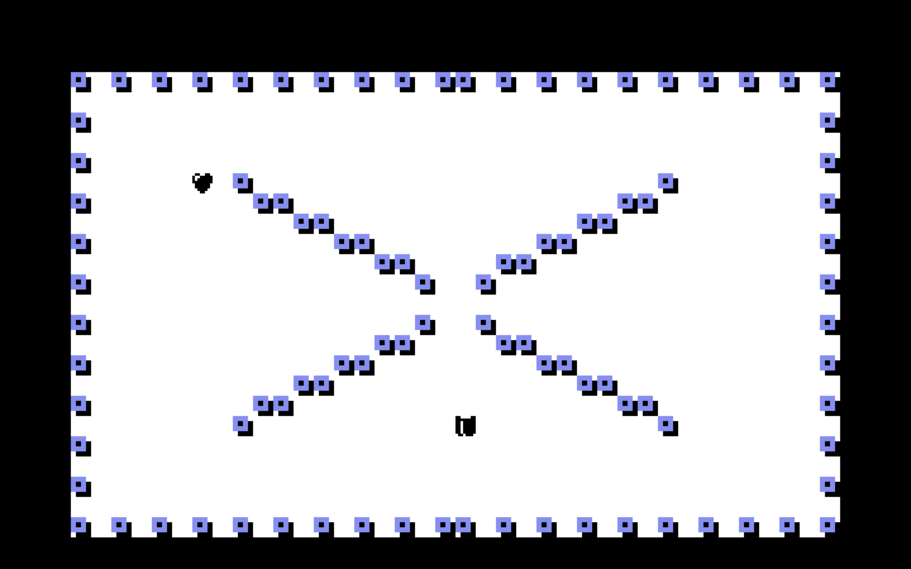

# xzap

Recreating the Xzap shoot-em-up, by Mark Wirt, in Godot. The game was released on the Commodore 16/+4 in 1984.

It is at a very early stage, focusing on the player and enemy movement around the obstacles.

## Setup

* Install the latest stable version of the [Godot game engine](https://godotengine.org/). This version was created on version 3.1.1.
* Run from inside Godot using Command + B on Mac.
* Use the keyboard arrows to move the ship.
* To stop the game, go back to the Godot window and press Command + .
