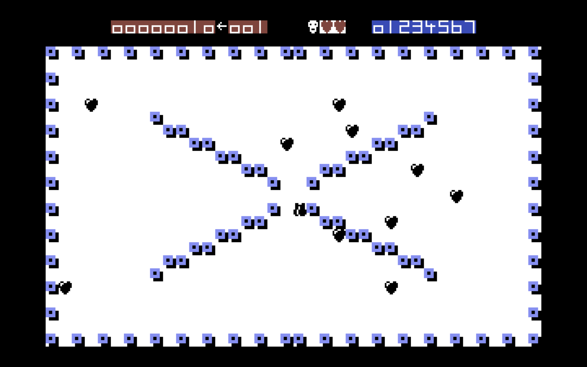

# xzap

This project aims to recreate the Xzap shoot-em-up, by Mark Wirt, in Godot. The game was released on the Commodore 16/+4 in 1984.

## Setup

* Install the latest stable version of the [Godot game engine](https://godotengine.org/). This version was created on version 3.1.1.
* Run from inside Godot using Command + B on Mac.
* Use the keyboard arrows to move the ship.
* To stop the game, go back to the Godot window and press Command + .

## Game rules

These are taken from the [Commodore 16 Showcase booklet](http://plus4world.powweb.com/publications/The_Commodore_16_Showcase_Booklet) . They will be added to as game functionality becomes available.

### Objective

You are a lone XZAPPER, last survivor of an advanced civilisation. Many centuries ago, your planet was besieged by alien hordes. Now only you remain. The aliens have the advantage of numbers, but you are on home territory.

Your objective is to destroy the aliens on each level, and so progress through 140 different levels.

### How to play the game

|Enemy|Description|
|---|---|
||HEARTS - can be destroyed at any time.|
||MINES - mines count down from 9, 7 or 5 to 0 and then produce a force-field. If your ship is caught in this force-field, then you lose a life. *NOTE:* A force-field can only be produced from the solid sides of a mine. Mines can only be destroyed once all the aliens have been eliminated. Green mines must be destroyed first. You must hit a green mine on one of its solid sides to destroy it. As each green mine is destroyed, another turns green. Your shots bounce off red mines. *NOTE:* Your ship can touch the red mines, but not the green mines.|
